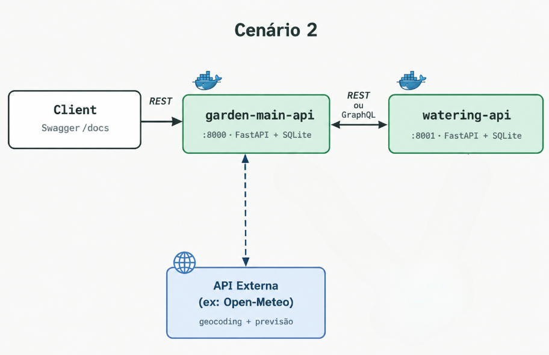

# garden-main-api

Main API of the **Smart Garden** MVP, a project for the Software Architecture
course (PUC). It solves the guesswork behind watering houseplants: register a
plant and its city, and the system tells you, every day, whether to **water**,
**postpone** (rain is coming) or **wait** (not due yet).

Secondary component: [watering-api](https://github.com/lucimidori92/watering-api)

## Objective

Given a plant's nickname, type and city, the system:

1. resolves the city into coordinates via Open-Meteo's geocoding API and stores the plant;
2. on `GET /schedule`, groups all plants by city and fetches one rain forecast per city from Open-Meteo;
3. sends each plant's type, last watering date and expected rain to `watering-api`;
4. returns a watering decision — `water`, `wait`, `postpone` or `no_rule` — for every plant.

## Architecture

This project follows **Scenario 2**: the main API is the entry point and
orchestrator. It consults an external service for geocoding and rain
forecasts, and delegates the watering rules and the day-to-day decision to a
secondary API.



| Service | Port | Swagger |
|---|---|---|
| `garden-main-api` | 8000 | <http://localhost:8000/docs> |
| `watering-api` | 8001 | <http://localhost:8001/docs> |

**Communication strategies:**

- **Synchronous REST with JSON.** `garden-main-api` coordinates every call.
- **Service discovery through Docker Compose's DNS.** `garden-main-api` calls
  `http://watering-api:8001`, with the URL read from the `WATERING_API_URL`
  environment variable — never hardcoded.
- **One database per service.** `watering-api` doesn't store plants; it
  receives everything it needs in each request, which keeps the two services
  decoupled and independently testable.
- **Timeouts and graceful failure.** Every outbound call has a 5-second
  timeout. If Open-Meteo or `watering-api` is unreachable, the response is a
  clear `503`, never a bare `500` or a hang.

## The external API: Open-Meteo

[Open-Meteo](https://open-meteo.com/) provides geocoding and weather-forecast
data. No signup or API key is required for non-commercial use, and its data
is licensed under [CC BY 4.0](https://creativecommons.org/licenses/by/4.0/),
which requires attribution — given here.

Routes used:

| Endpoint | Purpose |
|---|---|
| `GET https://geocoding-api.open-meteo.com/v1/search` | Resolves a city name into coordinates and state, used by `POST /plants` |
| `GET https://api.open-meteo.com/v1/forecast` | Returns the precipitation forecast for today and tomorrow, used by `GET /schedule` |

Both are consumed and transformed inside `garden-main-api` (`app/clients/open_meteo.py`) —
the response is never redirected to the caller.

## Prerequisites

- [Docker](https://docs.docker.com/get-docker/) and Docker Compose
- Git

There are three ways to run this API, from most to least complete:

## Running with Docker Compose (recommended)

Runs both services together, fully wired up.

`docker-compose.yml` builds both services, so clone the two repositories as
sibling folders:

```bash
mkdir smart-garden && cd smart-garden
git clone https://github.com/lucimidori92/garden-main-api.git
git clone https://github.com/lucimidori92/watering-api.git
cd garden-main-api
docker compose up --build
```

- `garden-main-api` Swagger UI: <http://localhost:8000/docs>
- `watering-api` Swagger UI: <http://localhost:8001/docs>

## Running only garden-main-api with Docker

Use this if `watering-api` is already running elsewhere (another container,
another host) at the URL you pass below. Without it reachable, calls that
depend on it (`GET /schedule`) return a `503`, per the graceful-failure
behavior described above.

```bash
docker build -t garden-main-api .
docker run -p 8000:8000 -e WATERING_API_URL=http://host.docker.internal:8001 garden-main-api
```

## Running without Docker

For full functionality you'll also need `watering-api` running locally on
port 8001 — see its own README for the equivalent steps. This API defaults
to `WATERING_API_URL=http://localhost:8001`, so no extra configuration is
needed once it's up.

```bash
python -m venv .venv
source .venv/bin/activate
pip install -r requirements-dev.txt
uvicorn app.main:app --reload --port 8000
```

## Routes

| Method | Route | Calls | Description |
|---|---|---|---|
| GET | `/` | — | Friendly status message confirming the API is running |
| POST | `/plants` | Open-Meteo (geocoding) | Registers a plant; resolves its city into coordinates. `404` if the city has no match, `409` if the same nickname, type and city is already registered |
| GET | `/plants` | — | Lists plants with filters (`plant_type`, `city`), sorting (`sort_by`, `order`) and pagination (`page`, `page_size`) |
| PUT | `/plants/{id}` | Open-Meteo, only if the city changed | Updates a plant, including `last_watered_at` (how "watered today" is recorded). `404` if not found, `409` if the update collides with another plant's nickname, type and city |
| DELETE | `/plants/{id}` | — | Deletes a plant. `404` if not found |
| GET | `/schedule` | Open-Meteo (forecast) → `watering-api` | Groups plants by city, fetches one forecast per city, and returns a watering decision for every plant |

Full interactive documentation, with example payloads: <http://localhost:8000/docs>

## Examples

```bash
curl http://localhost:8000/

curl -X POST http://localhost:8000/plants \
  -H "Content-Type: application/json" \
  -d '{"nickname": "Basil on the windowsill", "plant_type": "herb", "city": "Campinas"}'

curl "http://localhost:8000/plants?plant_type=herb&page=1&page_size=20"

curl -X PUT http://localhost:8000/plants/1 \
  -H "Content-Type: application/json" \
  -d '{"last_watered_at": "2026-09-25"}'

curl -X DELETE http://localhost:8000/plants/1

curl http://localhost:8000/schedule
```

## Docker persistence

Each service persists its SQLite database through its own named Docker volume:

| Volume | Mounted at | Service |
|---|---|---|
| `garden-main-dados` | `/app/data` | `garden-main-api` |
| `watering-dados` | `/app/data` | `watering-api` |

`docker compose down` keeps this data; `docker compose down -v` resets it
(used before recording a demo, for a clean slate).

## Project structure

```text
garden-main-api/
├── app/
│   ├── main.py              # FastAPI app and router registration
│   ├── config.py            # Environment-based configuration
│   ├── database.py          # SQLAlchemy engine and session
│   ├── models.py            # Plant model
│   ├── schemas.py           # Pydantic request/response schemas
│   ├── clients/
│   │   ├── open_meteo.py    # Geocoding and rain-forecast client
│   │   └── watering_api.py  # Client for watering-api's /evaluations
│   └── routers/
│       ├── plants.py        # Plant CRUD
│       └── schedule.py      # GET /schedule
├── docs/
│   └── architecture.png
├── docker-compose.yml
├── Dockerfile
├── requirements.txt
└── requirements-dev.txt
```

## Tests

No automated tests exist yet for `garden-main-api`. `watering-api` has its
own unit test suite for the watering decision logic — see its README.

## Technologies

- Python 3.12
- FastAPI
- SQLAlchemy
- SQLite
- httpx
- Docker / Docker Compose

## Author

MVP developed for the Software Architecture course assignment (PUC).
